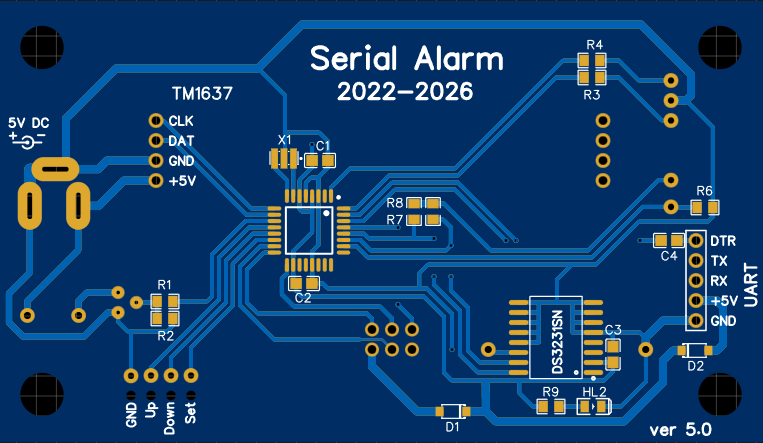
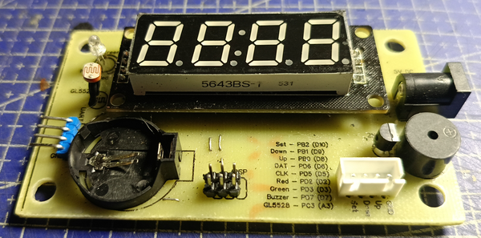
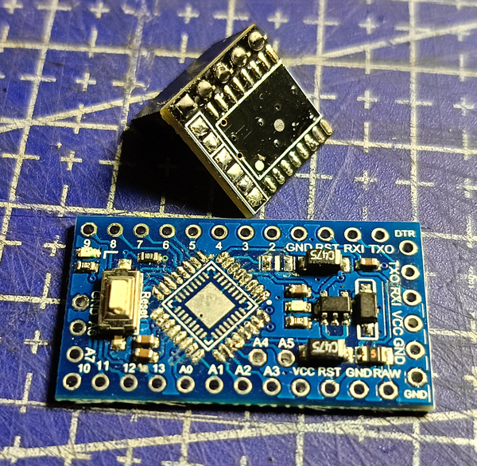

В папке лежат файлы для создания печатной платы устройства.

- **PCB_serial_alarm_1.5xx.zip** - архив с компонентами печатной платы в формате ***.pdf**; 
- **Gerber_serial_alarm_1.5xx.zip** - файл для заказа изготовления печатной платы, например, [здесь](https://www.pcbwave.com/);
- **EasyEDA/EasyEDA_project.zip** - файл проекта для импорта в программу [EasyEDA](https://easyeda.com/), если вдруг понадобится что-то изменить или доработать;
- **Schematic_serial_alarm_1.5x.png** - принципиальная схема устройства; отличается от приведенной в папке **docs** использованием **МК** и **RTC** в виде голых микросхем;

На плате используется модуль семисегментного индикатора типоразмера **0.56** на драйвере **TM1637**, который впаивается в плату "бутербродом".

Вместо готового модуля **RTC** используется голая микросхема **DS3231**. Донором послужил мини-модуль.

Вместо **Arduino Pro Mini** используется голый микроконтроллер **Atmega328p** или **Atmega168p** с кварцевым резонатором **X1**. И то, и другое лично я, не мудрствуя лукаво, выпаял с платы **Arduino Pro Mini**.

Для загрузки прошивки в **МК** на плате предусмотрен шестипиновый разъем **ICSP** для подключения программатора, например, **USBasp**.

Если не предполагается использовать загрузчик для заливки прошивки в **МК**, то разъем для подключения **UART** необязателен к установке, т.к. в коде взаимодействие с интерфейсом не предусмотрено. Так же в этом случае необязательно использовать конденсатор **C4** и диод **D2**.

Остальные компоненты в пояснениях (как мне кажется) не нуждаются.
