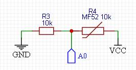

## serial_alarm v1.5.6

- [Описание](#описание)
- [Управление](#управление)
- [Звуковой сигнализатор](#звуковой-сигнализатор)
- [Дополнительные возможности](#дополнительные-возможности)
  - [Календарь](#календарь)
  - [Автоматическое управление яркостью экрана](#автоматическое-управление-яркостью-экрана)
  - [Регулировка минимального и максимального уровней яркости экрана](#регулировка-минимального-и-максимального-уровней-яркости-экрана)
  - [Вывод на экран текущей температуры](#вывод-на-экран-текущей-температуры)
    - [Датчики температуры](#датчики-температуры)
  - [Автовывод дополнительной информации на экран](#автовывод-дополнительной-информации-на-экран)
  - [Вывод на экран текущих настроек сигнализатора](#вывод-на-экран-текущих-настроек-сигнализатора)
- [Подключение модулей](#подключение-модулей)
- [Использованные сторонние библиотеки](#использованные-сторонние-библиотеки)

### Описание

Последовательный звуковой сигнализатор - это часы с возможностью выдачи звукового сигнала через равные интервалы времени в промежутке между заданным временем начала и конца сигнализации. Например, если задан промежуток с 20:00 до 05:00 с интервалом в три часа, сигнал сигнализатора будет срабатывать в 20:00, 23:00 и 02:00. Время 05:00 является временем завершения работы и перехода сигнализатора в неактивный режим до 20:00. Если нужно, чтобы сигнал сработал и в 05:00, время окончания нужно задать хотя бы на минуту позже - 05:01.

### Управление

Часы управляются тремя кнопками: **Set** - вход в режим настроек, выбор настраиваемого параметра и сохранение изменений; **Up** - увеличение текущих значений; **Down** - уменьшение текущих значений.

***ВАЖНО!!!** - устройство создано с использованием библиотеки [shSimpleClock](https://github.com/VAleSh-Soft/shSimpleClock), которая сама обрабатывает события этих кнопок, поэтому использование дополнительных библиотек для работы с кнопками не нужно ([о работе с кнопками см. здесь](https://github.com/VAleSh-Soft/shSimpleClock/blob/main/docs/buttons.md))*

Вход в настройки текущего времени выполняется удержанием нажатой кнопки **Set** в течение одной секунды.

Дополнительно можно задать подтверждение звуком каждого клика кнопкой. Это может быть полезно, например, при использовании сенсорных кнопок. Для этого нужно раскомментировать строку `#define USE_BUZZER_FOR_BUTTON` и задать пин с подключенной пищалкой с строке `int8_t constexpr BUZZER_PINint8_t constexpr BUZZER_PIN` в файле **clockSetting.h**.

### Звуковой сигнализатор

Состояние сигнализатора показывает двухцветный светодиод - если сигнализатор включен, светодиод светится, при этом, если текущее время входит в рабочий промежуток (сигнализатор в активном режиме), светодиод светится зеленым цветом, иначе (сигнализатор в неактивном режиме) - красным; если сигнализатор сработал, светодиод мигает зеленым.

Для однократного (один раз в сутки) срабатывания сигнализатора достаточно задать одинаковое время начала и конца, величина интервала при этом настраиваться не будет.

Сигнал сработавшего сигнализатора отключается кликом любой кнопки.

В режим настройки сигнализатора можно перейти по двойному клику кнопкой **Set**. Включение/выключение сигнализатора выполняется кнопками **Up** или **Down**. После включения сигнализатора следующий клик кнопкой **Set** переводит в режим настройки времени и интервала срабатывания. 

Каждый раздел настроек сигнализатора обозначается соответствующими символами: 
- **AL:** - включение/отключение сигнализатора; 
- **Р1:** - время начала (переход сигнализатора в активное состояние и первое срабатывание); 
- **Р2:** - время окончания (переход сигнализатора в неактивное состояние); 
- **It:** - интервал срабатывания (настраивается в диапазоне 10-180 минут с шагом в 10 минут);

### Дополнительные возможности

#### Календарь

Если нужно, чтобы сигнализатор отслеживал не только время, но и дату, достаточно раскомментировать строку `#define USE_CALENDAR` в файле **clockSetting.h**. Вывод даты на экран будет выполняться по клику кнопкой **Down**. Дополнительную информацию [см. здесь](https://github.com/VAleSh-Soft/shSimpleClock/blob/main/docs/calendar.md).

#### Автоматическое управление яркостью экрана

Предусмотрена возможность снижения яркости экрана при слабом освещении по данным датчика освещенности - фоторезистора типа **GL5528**, подключенного к пину **A3**. Для этого нужно раскомментировать строку `#define USE_LIGHT_SENSOR` в файле **clockSetting.h**. 

Схема подключения датчика:

 
 Дополнительную информацию [см. здесь](https://github.com/VAleSh-Soft/shSimpleClock/blob/main/docs/light_sensor.md).

Если использование датчика света не предполагается, индикатор всегда будет работать с максимальной яркостью. 

#### Регулировка минимального и максимального уровней яркости экрана

Для того, чтобы иметь возможность регулировать яркость экрана, нужно раскомментировать строку `#define USE_SET_BRIGHTNESS_MODE` в файле **clockSetting.h**. В этом случае по удержанию одновременно нажатыми кнопок **Up** и **Down** часы будут переходить в режим настройки яркости. При использовании датчика света можно будет настраивать как минимальный, так и максимальный уровни, а так же порог переключения (в "попугаях", т.е. в условных процентах показаний датчика освещенности), иначе можно будет настроить только максимальный уровень яркости экрана.

Кнопка **Set** в этом режиме сохраняет введенные данные и переключает режимы, кнопками **Up** и **Down** настраивается желаемый уровень. Яркость может иметь значение 1..7, порог переключения - 1..9.

Настройки будут сохранены в EEPROM.

Дополнительную информацию [см. здесь](https://github.com/VAleSh-Soft/shSimpleClock/blob/main/docs/br_adjust.md).

#### Вывод на экран текущей температуры

Для вывода на экран текущей температуры нужно раскомментировать строку `#define USE_TEMP_DATA` в файле **clockSetting.h**. В этом случае в режиме отображения текущего времени клик кнопкой **Up** будет выводить на пару секунд температуру окружающей среды.

##### Датчики температуры

Температура по умолчанию берется из внутреннего датчика микросхемы **DS3231**, однако есть возможность использования внешнего датчика DS18b20. Для этого нужно раскомментировать строку `#define USE_DS18B20` в файле **clockSetting.h**.

Схема подключения датчика DS18b20:

Или же в качестве датчика температуры **NTC** термистора, например **MF52**. Для этого нужно раскомментировать строку `#define USE_NTC` в файле **clockSetting.h**.

Схема подключения термистора:

Дополнительную информацию [см. здесь](https://github.com/VAleSh-Soft/shSimpleClock/blob/main/docs/temp_sensors.md).

#### Автовывод дополнительной информации на экран

Библиотека [shSimpleClock.h](https://github.com/VAleSh-Soft/shSimpleClock) позволяет выводить дату (если используется календарь) и температуру автоматически через равные промежутки времени. 

Настройка интервалов вывода выполняется по удержанию нажатой кнопки **Down**; доступные значения - 0, 1, 5, 10, 15, 20, 30, 60 минут; при выборе значения 0 автовывод отключается ([см. здесь](https://github.com/VAleSh-Soft/shSimpleClock/blob/main/docs/setting.md#настройка-периода-автовывода-даты-иили-температуры)).

#### Вывод на экран текущих настроек сигнализатора

В режиме отображения текущего времени клик кнопкой **Set** выводит на экран данные по текущим настройкам сигнализатора - время перехода сигнализатора в активное состояние (**P1**), время перехода сигнализатора в неактивное состояние (**P2**) и интервал срабатывания сигнализатора (**It**). Данные выводятся только в случае, если сигнализатор включен. Если заданы одинаковые **P1** и **P2** (однократное срабатывание будильника), то будет показано только время **P1**.

### Подключение модулей

Часы построены с использованием модуля **DS3231**, семисегментного экрана  с драйвером **TM1637** и **Arduino Pro Mini** на базе **ATmega328p** (можно использовать и на базе **ATmega168p**, но, возможно, без загрузчика). В качестве источника звука использован пассивный пьезоэлектрический излучатель. Индикаторный светодиод двухцветный, с общим катодом.

Пины для подключения экрана, модуля DS3231, кнопок и датчиков температуры и освещенности определены в файле **clockSetting.h** (см. описание библиотеки [shSimpleClock](https://github.com/VAleSh-Soft/shSimpleClock/blob/main/docs/clock_setting.md)). Пины для подключения пищалки и светодиода задается в файле **header_file.h**.

### Использованные сторонние библиотеки

**shSimpleClock.h** - https://github.com/VAleSh-Soft/shSimpleClock 

Для работы с экраном используется библиотека 
**TM1637Display.h** - https://github.com/avishorp/TM1637 

для работы с датчиком **DS18b20** используется библиотека 
**OneWire.h** - https://github.com/PaulStoffregen/OneWire

Если возникнут вопросы, пишите на valesh-soft@yandex.ru 